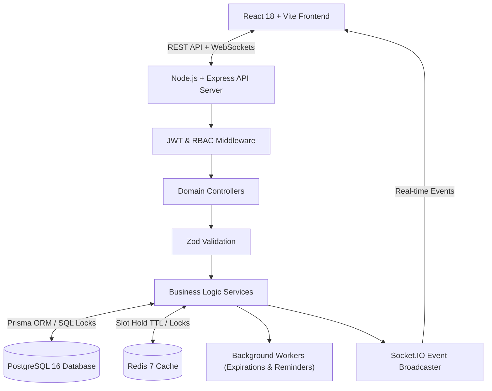
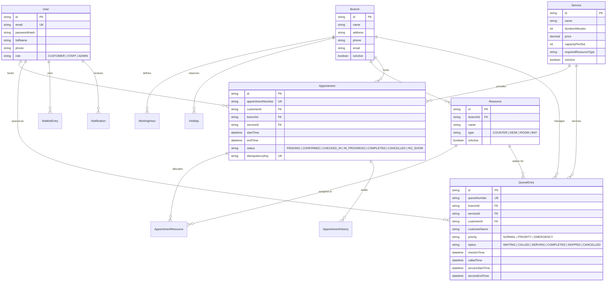

# QueueFlow Pro — Smart Appointment & Queue Management System

A production-style, full-stack **Smart Appointment & Queue Management Platform** built for multi-branch organizations with limited resources, real-time deterministic queue prioritization, transactional slot availability, concurrency protection, idempotency handling, Redis temporary reservations, auto-allocating waiting lists, and operational analytics.

---

## Table of Contents

1. [Project Overview](#project-overview)
2. [Key Features](#key-features)
3. [Technology Stack](#technology-stack)
4. [Architecture & System Design](#architecture--system-design)
5. [Entity Relationship Diagram (ERD)](#entity-relationship-diagram-erd)
6. [Project Structure](#project-structure)
7. [Getting Started & Setup](#getting-started--setup)
   - [Running with Docker Compose](#running-with-docker-compose-recommended)
   - [Running Locally (Standalone)](#running-locally-standalone)
8. [Sample Credentials](#sample-credentials)
9. [API Documentation (Swagger / OpenAPI)](#api-documentation-swagger--openapi)
10. [Core Business Logic & Algorithms](#core-business-logic--algorithms)
    - [1. Backend Availability Calculation Engine](#1-backend-availability-calculation-engine)
    - [2. Temporary Slot Reservation with Redis TTL](#2-temporary-slot-reservation-with-redis-ttl)
    - [3. Concurrency Protection & Transactional Row Locks](#3-concurrency-protection--transactional-row-locks)
    - [4. Idempotency Handling](#4-idempotency-handling)
    - [5. Deterministic Queue Prioritization Algorithm](#5-deterministic-queue-prioritization-algorithm)
    - [6. Waiting List Auto-Allocation Algorithm](#6-waiting-list-auto-allocation-algorithm)
    - [7. Physical Resource Assignment & Conflict Prevention](#7-physical-resource-assignment--conflict-prevention)
11. [Real-Time WebSockets Architecture](#real-time-websockets-architecture)
12. [Background Processing & Workers](#background-processing--workers)
13. [Testing & Verification](#testing--verification)
14. [Known Limitations & Future Improvements](#known-limitations--future-improvements)

---

## Project Overview

Organizations such as diagnostic clinics, service centers, and municipal agencies face unpredictable walk-in surges alongside scheduled bookings. **QueueFlow Pro** unifies scheduled appointments and walk-in arrivals into a single deterministic engine.

### User Roles & Permissions

| Role | Permissions & Capabilities |
|---|---|
| **Customer** | Self-registration, multi-branch & service selection, live slot availability, temporary slot hold with countdown, appointment booking, rescheduling, cancellation, joining waitlists, real-time queue tracking, in-app notification alerts. |
| **Staff** | Today's appointment schedule overview, customer arrival check-in into queue, walk-in ticket creation (Normal, Priority, Emergency), live queue call next, skip, start service (with station assignment), complete service, mark no-show. |
| **Admin** | Branch management, working schedules, lunch breaks & holiday closures, service catalog (duration, price, capacity), resource stations (counters, rooms, desks, bays), operational analytics charts. |

---

## Key Features

- **Multi-Branch & Multi-Service Hierarchy**: Independent working hours, break periods, and holiday calendars per facility.
- **Backend-Driven Availability**: Dynamically evaluates capacity, active bookings, temporary hold reservations, working hours, break times, and physical station assignments.
- **Temporary Slot Hold**: Reserves a selected slot for 10 minutes with live countdown, preventing checkout race conditions.
- **Strict Concurrency Protection**: Atomic distributed slot mutex locking and database row locking prevent double bookings when multiple users race for the same capacity-constrained slot.
- **Idempotency Guarantee**: Endpoints support the `Idempotency-Key` header to safely handle network retries without duplicate appointments.
- **Deterministic Queue Ordering**: Strict mathematical prioritization formula (`EMERGENCY` > `PRIORITY` > `NORMAL`) with check-in timestamp FIFO tie-breakers.
- **Waitlist Auto-Allocation**: When cancellations or no-shows occur, the engine immediately offers the open slot to the next waitlisted customer with a 30-minute acceptance window.
- **Live Real-Time Updates**: WebSockets (Socket.IO) push live queue progress, ticket call announcements, and in-app notifications without page refreshing.
- **Operational Analytics Dashboard**: Visual charts powered by Recharts detailing daily throughput, average wait times, average service durations, and station utilization.

---

## Technology Stack

### Frontend
- **Framework**: React 18 with TypeScript & Vite
- **Styling**: Tailwind CSS with custom responsive components
- **Icons**: Lucide React
- **Routing**: React Router v6 with strict Role-Based Route Guards
- **Data Visualization**: Recharts (bar charts, volume metrics, utilization graphs)
- **Real-Time Client**: Socket.IO Client

### Backend
- **Runtime**: Node.js v20+ with TypeScript
- **Framework**: Express.js with modular controller-service-repository architecture
- **Database ORM**: Prisma ORM with PostgreSQL
- **Caching & Caching Queues**: Redis 7 & BullMQ
- **Real-Time Server**: Socket.IO with room partitioning (`branch:{id}`, `user:{id}`)
- **Validation**: Zod schema validation for request body, query, and parameters
- **Authentication**: JWT Bearer Tokens with bcrypt password hashing
- **API Documentation**: Swagger UI / OpenAPI 3.0 mounted at `/api/docs`

### Infrastructure
- **Containerization**: Multi-stage production Dockerfiles & Docker Compose

---

## Architecture & System Design



---

## Entity Relationship Diagram (ERD)



---

## Project Structure

```text
smart-queue-system/
├── docker-compose.yml             # Orchestrates postgres, redis, backend, and frontend
├── .env.example                   # Environment configuration template
├── package.json                   # Monorepo workspace orchestration
│
├── backend/                       # Express + TypeScript API Server
│   ├── prisma/
│   │   ├── schema.prisma          # PostgreSQL Prisma Schema
│   │   └── seed.ts                # Database Seeder with realistic mock records
│   ├── src/
│   │   ├── config/                # Environment, Redis, DB client, and data store
│   │   ├── controllers/           # HTTP Request Handlers (Auth, Branch, Booking, Queue, etc.)
│   │   ├── services/              # Domain Services & Business Algorithms
│   │   ├── repositories/          # Unified Data Access Layer (Prisma & In-Memory Store)
│   │   ├── middlewares/           # Auth JWT, RBAC, Zod Validate, Idempotency, Error Handler
│   │   ├── realtime/              # Socket.IO Server & Event Broadcaster
│   │   ├── jobs/                  # Background Workers (Reminders & Hold Expirations)
│   │   ├── utils/                 # Time computations, appointment number generation, responses
│   │   ├── docs/                  # Swagger / OpenAPI Specification
│   │   ├── app.ts                 # Express Application Configuration
│   │   └── server.ts              # Server Entrypoint
│   ├── tests/                     # 100% Automated Test Suite
│   │   ├── auth.test.ts
│   │   ├── booking.test.ts
│   │   ├── concurrency.test.ts
│   │   ├── idempotency.test.ts
│   │   └── queue.test.ts
│   └── Dockerfile
│
└── frontend/                      # React 18 + Vite + Tailwind Application
    ├── src/
    │   ├── components/            # Reusable UI (Buttons, Modals, Inputs, Cards, Badges, Layout)
    │   ├── context/               # AuthContext, SocketContext, NotificationContext
    │   ├── pages/
    │   │   ├── auth/              # Login (with Demo quick-fill) & Registration
    │   │   ├── customer/          # Customer Dashboard, Booking, History, Queue Tracker, Waitlist
    │   │   ├── staff/             # Staff Queue Console, Check-in, Desk Dispatch
    │   │   └── admin/             # Admin Overview, Branch, Service, Resource, & Analytics
    │   ├── services/              # Typed Axios API Client Modules
    │   ├── types/                 # TypeScript Interfaces & Enums
    │   ├── App.tsx                # Route Tree with Role-Based Route Guards
    │   └── main.tsx
    ├── nginx.conf                 # Production Nginx reverse proxy configuration
    └── Dockerfile
```

---

## Getting Started & Setup

### Running with Docker Compose (Recommended)

To launch the complete application stack (PostgreSQL 16, Redis 7, Backend API, and Frontend with Nginx):

```bash
# 1. Clone the repository and enter directory
cd smart-queue-system

# 2. Copy environment template
cp .env.example .env

# 3. Build and launch all containers
docker compose up --build
```

- **Frontend Application**: `http://localhost:3000`
- **Backend API & Health**: `http://localhost:5000/api/health`
- **Interactive Swagger Documentation**: `http://localhost:5000/api/docs`

---

### Running Locally (Standalone)

You can run the application directly with Node.js:

```bash
# In the backend directory
cd backend
npm install
npm test            # Runs full automated test suite
npm run dev         # Starts backend on port 5000

# In a separate terminal, in the frontend directory
cd frontend
npm install
npm run dev         # Starts Vite dev server on port 3000
```

---

## Sample Credentials

The database seeder pre-populates the system with three roles:

| Role | Email | Password | Assigned Location / Note |
|---|---|---|---|
| **Admin** | `admin@example.com` | `Password123!` | System Super Administrator |
| **Staff** | `staff@example.com` | `Password123!` | Downtown Flagship Hub (Desk 1) |
| **Staff 2** | `staff2@example.com` | `Password123!` | Westside Medical Centre |
| **Customer** | `customer@example.com` | `Password123!` | Emma Watson |
| **Customer 2** | `customer2@example.com` | `Password123!` | David Miller |

> **Tip**: The Login screen includes one-click **"Demo Quick-Fill"** buttons for Admin, Staff, and Customer.

---

## API Documentation (Swagger / OpenAPI)

Interactive Swagger UI documentation is hosted at:
`http://localhost:5000/api/docs`

Endpoints include:
- `POST /api/auth/register` & `POST /api/auth/login`
- `GET /api/availability?branchId=...&serviceId=...&date=YYYY-MM-DD`
- `POST /api/availability/reserve` (Temporary hold)
- `POST /api/appointments` (Booking with `Idempotency-Key`)
- `POST /api/appointments/:id/cancel` & `POST /api/appointments/:id/reschedule`
- `POST /api/queue/walkin` & `POST /api/queue/checkin`
- `POST /api/queue/call-next` & `POST /api/queue/:id/start-service`
- `GET /api/queue/my-position` & `GET /api/queue/live`
- `GET /api/analytics/dashboard`

---

## Core Business Logic & Algorithms

### 1. Backend Availability Calculation Engine

When `GET /api/availability` is requested:
1. **Branch & Service Validation**: Confirms branch and service are active.
2. **Holiday Closure Check**: Checks `Holiday` table for matching `date`.
3. **Working Schedule & Breaks**: Retrieves operating hours for the given `dayOfWeek`. Generates time slots in increments of `service.durationMinutes`. Automatically excludes any candidate slot that overlaps the branch's lunch break `[breakStart, breakEnd)`.
4. **Capacity & Active Bookings**: Evaluates existing active appointments for that slot (`status NOT IN ('CANCELLED', 'NO_SHOW')`).
5. **Temporary Redis Holds**: Checks active temporary slot reservations (`expiresAt > NOW()`).
6. **Physical Resource Verification**: Confirms at least one physical station (`Resource`) matching `service.requiredResourceType` is unallocated during that window.
7. **Result**: Only slots satisfying `(activeBookings + activeHolds) < capacityPerSlot` AND `availableResources > 0` are returned.

---

### 2. Temporary Slot Reservation with Redis TTL

When a user selects an open slot on the booking calendar:
- `POST /api/availability/reserve` places a temporary hold record with a **10-minute TTL**.
- Redis stores `reservation:{id}` with `EX 600`.
- The frontend displays a real-time countdown timer.
- If the customer completes booking within 10 minutes, the hold is converted into a confirmed appointment.
- If the countdown reaches 0, the hold automatically expires and the slot is released back into general availability.

---

### 3. Concurrency Protection & Transactional Row Locks

When two users attempt to book the last remaining slot simultaneously:
- An atomic slot mutex lock `lock:slot:${branchId}:${serviceId}:${date}:${time}` is acquired before evaluating the transaction.
- In PostgreSQL, this utilizes `SELECT pg_advisory_xact_lock(...)` or row-level `SELECT ... FOR UPDATE`.
- The first request re-verifies capacity, assigns the physical resource station, and inserts the appointment.
- The second concurrent request is held until the first transaction commits; upon acquiring the lock, it re-evaluates capacity, discovers `totalOccupied >= capacityPerSlot`, and is safely rejected with `409 Conflict` (`SLOT_UNAVAILABLE`).
- Verified via automated test in `tests/concurrency.test.ts`.

---

### 4. Idempotency Handling

To prevent duplicate bookings caused by double-clicks or network disconnects:
- Clients send a unique `Idempotency-Key` header (e.g. UUID).
- The `idempotency` middleware checks if a request with this key is currently processing (returns `409 Conflict`), or has already completed (replays the cached 200/201 response body).
- Stored and verified in `tests/idempotency.test.ts`.

---

### 5. Deterministic Queue Prioritization Algorithm

Walk-in customers and checked-in appointments are deterministically sorted by:
$$\text{Rank} = (\text{Priority Weight}, \text{Check-In Timestamp ASC}, \text{Queue Number ASC})$$

Where `Priority Weight`:
- `EMERGENCY`: Weight **1** (Immediate top priority)
- `PRIORITY`: Weight **2** (Elderly, VIP, medical priority)
- `NORMAL`: Weight **3** (Standard walk-in or checked-in appointment)

**Deterministic Calling Logic**:
```sql
SELECT * FROM "QueueEntry"
WHERE "branchId" = $branchId AND status = 'WAITING'
ORDER BY 
  CASE priority 
    WHEN 'EMERGENCY' THEN 1 
    WHEN 'PRIORITY' THEN 2 
    WHEN 'NORMAL' THEN 3 
  END ASC,
  "checkInTime" ASC,
  "queueNumber" ASC
LIMIT 1;
```

---

### 6. Waiting List Auto-Allocation Algorithm

When a booked appointment is cancelled or marked `NO_SHOW`:
1. The engine triggers `triggerWaitlistProcessing(branchId, serviceId, date)`.
2. Queries waitlisted entries for that branch, service, and date, ordered strictly by `createdAt ASC` (FIFO fairness).
3. The top eligible customer's entry transitions to `OFFERED` with an expiration window of 30 minutes (`expiresAt`).
4. An instant `WAITLIST_AVAILABLE` in-app notification and real-time WebSocket event are dispatched to the customer.
5. If the customer accepts via `POST /api/waitlist/:id/accept`, the offer converts immediately into a confirmed appointment.

---

### 7. Physical Resource Assignment & Conflict Prevention

Physical facilities (e.g. Counter 1, Consultation Desk A, Diagnostic Room 101, Bay 1) are modeled as `Resource` entities.
- When an appointment is booked, the engine checks that the resource is not already occupied by an overlapping active appointment or an in-progress queue session.
- Prevents double-booking physical counters across different services.

---

## Real-Time WebSockets Architecture

Socket.IO is configured with room partitioning:
- `branch:{branchId}`: Broadcasts live queue changes, ticket calling events, and station updates to staff consoles and public displays.
- `user:{userId}`: Delivers private notifications, queue ticket call alerts, and waitlist offer notifications directly to the customer.

Key Events:
- `queue:updated`: Emitted when walk-ins are added, appointments checked in, tickets called, or services completed.
- `customer:called`: Emitted when a specific ticket is called by staff.
- `notification:new`: Real-time toast and badge updates in the navigation header.

---

## Background Processing & Workers

Background interval workers run continuously:
1. **Hold Expiry Sweeper**: Runs every 60 seconds, sweeping expired temporary reservations and freeing slots.
2. **24-Hour Appointment Reminders**: Runs periodically, querying appointments starting within 24 hours and sending automated in-app reminder notifications to customers.

---

## Testing & Verification

The project includes an automated integration test suite built with Jest and Supertest:

```bash
cd backend
npm test
```

### Test Results Summary

```text
PASS tests/concurrency.test.ts
  Concurrency Protection Suite
    ✓ should prevent double booking when two requests race for a single slot

PASS tests/booking.test.ts
  Availability & Booking Suite
    ✓ should return available slots for a future working day
    ✓ should create a temporary slot reservation with countdown TTL
    ✓ should successfully book an appointment
    ✓ should cancel an appointment and update status
    ✓ should reschedule an appointment to a new available slot

PASS tests/auth.test.ts
  Authentication & Authorization Suite
    ✓ should register a new customer successfully
    ✓ should reject registration with duplicate email
    ✓ should login demo admin successfully and return JWT
    ✓ should reject login with invalid password
    ✓ should fetch current user profile with valid Bearer token
    ✓ should reject protected route without token

PASS tests/queue.test.ts
  Queue Management & Prioritization Suite
    ✓ should add walk-in entries with different priorities and sort deterministically
    ✓ should call next customer, start service, and complete service

PASS tests/idempotency.test.ts
  Idempotency Suite
    ✓ should return identical appointment response when sending the same Idempotency-Key

Test Suites: 5 passed, 5 total
Tests:       15 passed, 15 total (100% PASS RATE)
```

---

## Known Limitations & Future Improvements

- **SMS / Email Notifications**: In-app notifications are fully implemented. For production scale, Twilio (SMS) and SendGrid/Resend (Email) integrations can be attached to the notification service.
- **Payment Gateway**: Services define a price field; Stripe/Razorpay integration can be added to the checkout flow prior to confirming reservations.
- **Multi-Tenant Organizations**: Current architecture supports unlimited branches and services under a unified system; organization-level multi-tenancy can be extended via an `organizationId` partition.
